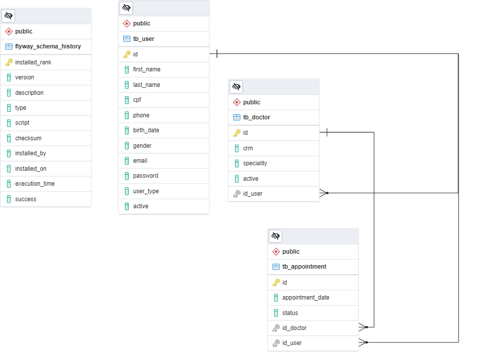

    
    <h1>HealthNove</h1>

##  Sobre

Este projeto tem como objetivo criar um sistema de agendamento médico para a Clínica HealthNove,
seguindo as normas estabelecidas pela clínica.
O sistema permitirá que os pacientes agendem consultas com médicos de diversas especialidades 
de forma eficiente e conveniente.

### Regras de negócio

 - Limitação de Consultas: Cada paciente poderá agendar apenas uma consulta por dia.
 - As consultas devem ser agendadas com pelo menos 1 hora de antecedência.
 - Horário de Funcionamento: A clínica opera de segunda a sábado, das 7h às 19h.
 - Duração da Consulta: Cada consulta possui uma duração padrão de 1 hora

### Especialidades Médicas

O sistema permitirá que os pacientes escolham entre as seguintes especialidades médicas para agendamento:

 - Cardiologia
 - Clínica Médica
 - Dermatologia
 - Gastroenterologia
 - Ginecologia
 - Pediatria
 - Pneumologia

## Tecnologias utilizadas

|  |  |  |  |
| :--: | :--: | :--: | :--: |
| Java | Spring | PostgreSQL | IntelliJ |

## Instalação

Antes de começar, certifique-se de ter as seguintes ferramentas instaladas em sua máquina:

- [Java](https://www.oracle.com/java/technologies/javase-downloads.html)
- [Maven](https://maven.apache.org/)
- [Git](https://git-scm.com/)
- [PostgreSQL](https://www.postgresql.org/)

Siga estas etapas para instalar e executar o projeto:
1. Clone o repositório: `git clone git@github.com:projetosUninove/healthNove-backend.git`

2. Compile o projeto usando o Maven: `mvn clean install`

3. No cliente PostgreSQL, crie um novo banco de dados: `CREATE DATABASE db_healthnove;`

4. Execute o projeto: `java -jar target/schedulingHealthNove.jar`

O aplicativo Spring será executado na porta padrão 8080. Você pode acessá-lo em http://localhost:8080.

## Arquitetura MVC

A escolha da arquitetura MVC para a realização deste projeto se baseia em diversas considerações que visam garantir um desenvolvimento eficiente e de alta qualidade. Abaixo, está alguns dos motivos que fundamentam a escolha:

 - **Simplicidade Inicial:** A arquitetura MVC oferece uma estrutura inicialmente mais simples para o projeto, crucial para o entendimento rápido das partes interessadas.

 - **Separação de Responsabilidades:** A arquitetura MVC promove separação clara de responsabilidades entre os componentes, permitindo a reutilização de componentes de forma eficaz e facilitando a criação de testes de unidade. 

 - **Considerações de Tamanho e Complexidade:** Embora existam arquiteturas mais complexas adequadas para projetos muito grandes e com alto fluxo de dados, o MVC ainda é escalável o suficiente para atender às necessidades deste projeto. 

Também foi utilizado o design pattern Strategy de forma a isolar as regras de negócio da aplicação, permitindo assim, adicionar, remover ou editar uma regra de forma rápida, prática e sem influenciar nas demais regras que já foram testadas e estão funcionando.

## Banco de Dados PostgreSQL

A escolha do banco de dados relacional para este projeto é devido a sua modelagem organizada, coesão, integridade e segurança dos dados.

###  Diagrama de Entidade-Relacionamento (DER)

### Alguns dos princípios utilizados no desenvolvimento do projeto:
`S.O.L.I.D`

`K.I.S.S`

`DRY`

`Tell don’t ask`

`Fail fast`

